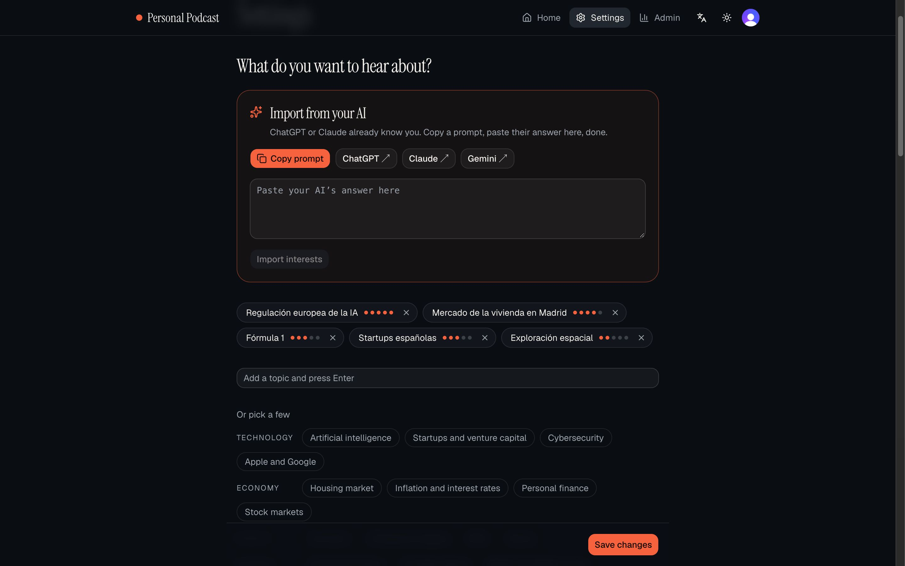
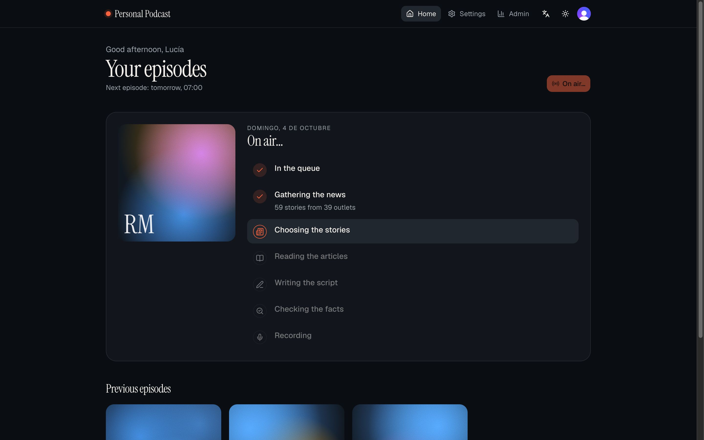
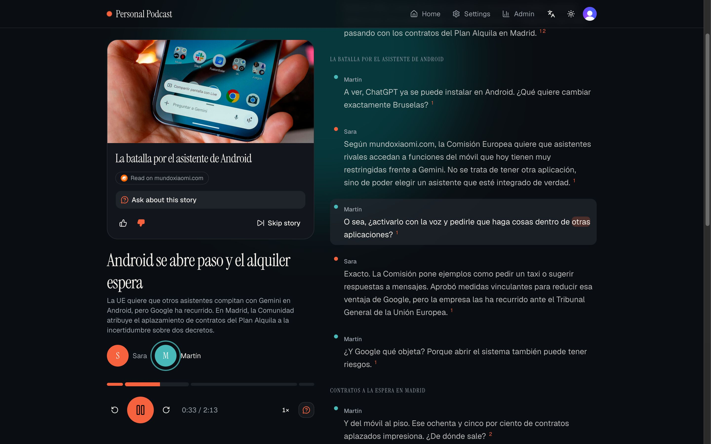
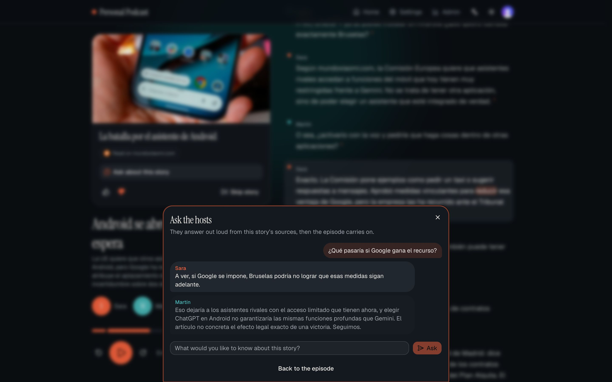
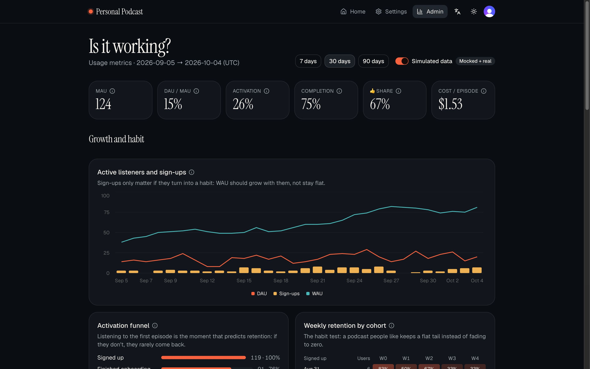
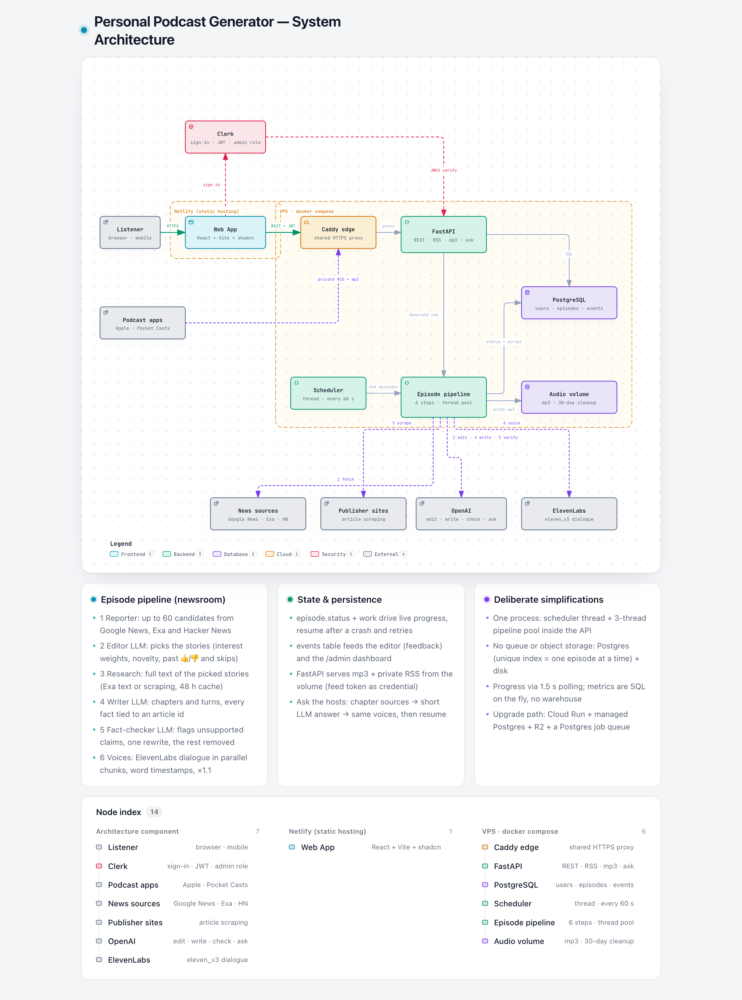

# Personal Podcast Generator — solution

**Live demo:** <https://podcast.scuda.es> · **Good episodes:** [`sample.mp3`](sample.mp3) (English, 10 min, [transcript with sources](docs/sample-transcript.md)) and [`sample-es.mp3`](sample-es.mp3) (Spain Spanish, 5 min (I personally prefer the spanigh version), [transcript](docs/sample-transcript-es.md)) · **Code:** this repo

A listener tells the app what they care about. Every day, at the time they choose, a small "newsroom" of
LLM steps reads today's news on those topics, picks the stories worth their time, writes a two-host
conversation where every fact points to an article, fact-checks it, and records it with ElevenLabs.
The episode is waiting in the web player (live transcript, sources, ask the hosts) and in their own
podcast app through a private RSS feed. An internal dashboard tells the team whether it's working.

Everything is real except the history behind the dashboard, which mixes the real events with 200
simulated listeners (clearly marked and switchable off).

---

## 1. Try it in 3 minutes

> **Voice credits:** the ElevenLabs key provided for the challenge ran out of quota while generating
> the final samples, so **new episodes and the hosts' spoken answers can't be produced right now**
> (they stop at *Recording* and offer *Retry*; nothing else breaks). Everything already produced works.
>
> - **Your own account:** anyone can sign up with their normal email (a code arrives by email) or with
>   Google. You'll see onboarding, Settings, the feed and the live production steps, but your episode will
>   stop at *Recording*.
> - **Demo account, to see a full podcast:** **Sign in** → `e2e+clerk_test@example.com` → *Use another
>   method* → *Email code* → `424242` (a Clerk test address: no email is sent). It has real episodes in
>   Spain Spanish, the private feed and the admin dashboard. The language switch in the top bar turns
>   the interface to English.
> - Both best episodes can be heard in the repo: [`sample.mp3`](sample.mp3) and [`sample-es.mp3`](sample-es.mp3).

1. Open <https://podcast.scuda.es> → **Get started** → sign up with an email (you get a code) or Google.
2. **Onboarding (5 short steps).** Type a few interests or press **Import from your AI**: copy the
   prompt into ChatGPT / Claude / Gemini, paste its answer back, and your interests, weights, topics
   to avoid and trusted outlets are filled in. Pick language (English or Spain Spanish), format,
   length, hosts (with voice previews) and the time it should arrive.
3. Your first episode starts right away: watch the newsroom at work (stories found, outlets, stories
   picked, claims checked, recording progress). It takes 1–3 minutes.
4. **Listen.** In the player:
   - **Live transcript:** the word being spoken lights up; tap any word to jump there. The small
     numbers after each sentence are its sources.
   - **Story card:** the article's picture, *Read on…* links to the original articles, 👍/👎 (kept after
     a reload, and used by the editor for your next episode) and *Skip story*.
   - **Chapter bar and controls:** −15 s, +30 s, speed from 0.8× to 2×; system media keys work too.
   - **Keyboard:** space to play/pause, ←/→ to move 5 s, Shift + ←/→ to change chapter.
   - **Ask about this story** (on the card, or the icon next to the controls): the episode pauses, you
     type a question or tap a suggestion, and the hosts answer out loud from that story's sources, then
     the episode resumes 2 s before where it stopped.
5. **Settings → Listen in your podcast app** gives a private feed for Apple Podcasts, Pocket Casts or
   any app ("Add by URL"). New episodes arrive there on their own.
6. **Internal dashboard:** `/admin` (users with the `admin` role in Clerk).

> Each episode spends real OpenAI and ElevenLabs credits. There's a limit of 5 on-demand episodes per
> user and day, and 10 questions per episode and hour. When you're done, set the schedule to *Only
> when I ask* in Settings.

## 2. Feature tour

| | |
|---|---|
|  | **Set up in seconds.** Interests with a 1–5 weight, topics to avoid, trusted outlets, or all of it imported from the AI that already knows you. |
|  | **The wait is part of the show.** Real numbers from each stage (here: 59 stories from 39 outlets) while the episode is produced. Polling every 1.5 s. |
|  | **Immersive player.** Word-level transcript (ElevenLabs timestamps), chapter bar, story card with image and sources, who is speaking, keyboard shortcuts and system media controls. |
|  | **Ask the hosts.** Pauses the episode; the hosts answer in their own voices from the story's articles, say so when the sources don't cover it, and the episode resumes 2 s before where it stopped. |
|  | **Is it working?** Growth, activation, retention, completion, skips, topics, adoption, cost and reliability, each with *why it matters* and its exact definition. |

## 3. Architecture

Interactive version: [`docs/arquitectura/architecture.html`](docs/arquitectura/architecture.html)
(source `architecture.json`, generated with archify).

- **Frontend:** React 19 + Vite + TypeScript + Tailwind + shadcn/ui, TanStack Query, on Netlify.
  Bilingual UI (EN/ES). The admin dashboard and its charts (Recharts) load lazily, only for admins.
- **Backend:** one FastAPI process (sync code, SQLModel + Alembic) on a small VPS with Docker
  Compose, behind a shared Caddy proxy for HTTPS. It serves the REST API, the RSS feeds and the MP3s.
- **Data:** PostgreSQL (`users`, `episodes`, `stories`, `articles`, `events`) and audio files on a disk
  volume (deleted after 30 days; transcripts stay).
- **Auth:** Clerk. The SPA sends Clerk's JWT, the API verifies it against Clerk's JWKS; the admin role
  is a claim from Clerk's public metadata. Audio and RSS can't send a JWT, so they use a per-user,
  revocable random feed token.
- **Background work, no queue:** a thread pool of 3 runs the episodes; a scheduler thread wakes up
  every 60 s, starts the episodes that are due (20 min before the listener's time, DST-safe) and
  deletes old audio. A partial unique index guarantees at most one episode in production per user,
  for "Generate now" and the scheduler alike. On restart, interrupted episodes resume at the stage
  they were in.

### The episode pipeline (the "newsroom")

Each step is a function that reads and writes a typed `Work` object saved in `episodes.work` after
every successful step, so a failure or a restart resumes at that step instead of starting over.

| Step | What it does | How |
|---|---|---|
| 1. Reporter | Up to 60 candidate stories for the listener's interests | Google News RSS (links resolved to the publisher), Exa search (with full text) and Hacker News, in parallel; normalized, deduplicated, filtered by *avoid* |
| 2. Editor | Picks the stories worth telling | `gpt-6-luna` with the listener's interests and weights, what they already heard (stories memory: follow-ups instead of repeats), past 👍/👎 and skips, trusted outlets |
| 3. Research | Reads the full articles | Exa text or scraping with trafilatura (48 h shared cache); up to 2 outlets per story; backups replace stories that can't be read |
| 4. Writer | Writes the conversation | `gpt-6-sol`: chapters and turns, every factual turn with the ids of its articles, natural spoken style (Spain Spanish when `es`), length targeted to the minutes chosen |
| 5. Fact-checker | Checks every claim against its sources | `gpt-6-sol` flags unsupported, exaggerated, misattributed or outdated claims; one rewrite round; anything still flagged is removed |
| 6. Voices | Records it | ElevenLabs `eleven_v3` Text to Dialogue in parallel chunks with word timestamps, joined and sped up ×1.1 with ffmpeg; the timeline is rebuilt for the karaoke transcript |

## 4. Key decisions and trade-offs

Every decision has an ADR with the alternatives considered ([`docs/decisiones/`](docs/decisiones/README.md),
written in Spanish). Three principles guided them: **simplest logic that works, impressive UX, a real
multi-user product.**

| Decision | Chosen | Main alternative | Why |
|---|---|---|---|
| Stack ([0001](docs/decisiones/0001-stack-fastapi-react.md)) | FastAPI + React/Vite/shadcn | Next.js full-stack | Python is the natural home for scraping, LLMs and audio; a static SPA is free to host |
| Hosting ([0002](docs/decisiones/0002-despliegue.md)) | Netlify + a small existing VPS (Docker Compose) | Cloud Run + managed DB | ffmpeg, a disk and long jobs fit a VPS; zero cost. Migration path documented |
| Database ([0003](docs/decisiones/0003-base-de-datos.md)) | PostgreSQL | SQLite, Firestore | Concurrent writers, JSONB for the pipeline state, partial unique index as a concurrency guard |
| Audio storage ([0004](docs/decisiones/0004-almacenamiento-audio.md)) | Disk volume, 30-day retention | Cloudflare R2 | One less service; R2 is ~20 lines away |
| Auth ([0005](docs/decisiones/0005-autenticacion.md)) | Clerk | Own auth, Supabase | Sign-up, Google, sessions and roles without writing auth |
| News sources ([0006](docs/decisiones/0006-fuentes-de-noticias.md)) | Google News RSS + Exa + Hacker News + scraping | NewsAPI, The Guardian | Coverage in any language and topic; The Guardian needs a company email. A spike measured Google News first |
| LLMs ([0007](docs/decisiones/0007-llm.md)) | OpenAI: small model to select, large model to write and check | One model for all | Quality where it's heard, low cost where it isn't |
| Voices ([0008](docs/decisiones/0008-tts.md)) | ElevenLabs Text to Dialogue (`eleven_v3`) | Per-turn TTS, OpenAI TTS | Natural two-host conversation in one request, with word timestamps for the transcript |
| Pipeline ([0009](docs/decisiones/0009-pipeline-de-episodio.md)) | 6 explicit steps with a fact-checker | One big prompt, embeddings ranking | Each step can be explained, tested and resumed; trust is the product |
| Execution ([0010](docs/decisiones/0010-programacion-y-ejecucion.md)) | Scheduler thread + thread pool in the API process; polling for progress | Celery/Redis, Cloud Tasks; SSE | Zero infrastructure at this scale; the DB enforces one episode per user |
| Delivery ([0011](docs/decisiones/0011-entrega-rss-privado.md)) | Private RSS feed per user | Email/push only | Arrives on its own in the app people already use for podcasts |
| Onboarding ([0012](docs/decisiones/0012-onboarding-importar-desde-ia.md)) | "Import from your AI" (copy a prompt, paste the answer) | OAuth to ChatGPT, long forms | Uses what the listener's AI already knows; zero integrations, tolerant parsing |
| Metrics ([0013](docs/decisiones/0013-dashboard-de-metricas.md)) | One `events` table + SQL computed on the fly | Analytics SaaS, warehouse | Same data for personalization and the dashboard; ~130 ms with 90 days of data |
| Player ([0014](docs/decisiones/0014-ux-reproductor-inmersivo.md)) | Word-synced transcript, story cards, ask the hosts | Plain audio player | Where we spent complexity, it shows |
| Language ([0015](docs/decisiones/0015-idioma-elegible.md)) | English or Spain Spanish | Any language | Only languages with native voices and a tested prompt |
| Audio assembly ([0016](docs/decisiones/0016-montaje-de-audio-ffmpeg.md)) | ffmpeg (concat + tempo) | pydub, server-side mixing | One tool, no re-encoding of the chunks |

Simplifications we chose knowingly (each marked in the code where it lives):
- **No queue or worker service.** One process; if the API ever runs twice, the next step is
  `SELECT … FOR UPDATE SKIP LOCKED` (Postgres as the queue), not Redis.
- **No cache or warehouse for metrics.** Plain SQL over the events table answers in ~130 ms for 90 days.
- **Polling instead of SSE.** `EventSource` can't send the JWT; ~100 tiny requests per episode don't matter.
- **Static cover for the feed, CSS covers in the app.** No image generation per episode.

## 5. Quality: how it's tested

- **TDD on every branch:** a failing test first, then the code; evidence per branch in
  [`docs/testing/`](docs/testing). **163 backend tests** (pytest against a real Postgres, external APIs
  faked) and **39 frontend tests** (Vitest), plus live tests against the real news APIs
  (`pytest -m live`). Lint and types are clean (ruff, oxlint, TypeScript strict).
- **Real runs** for every stage of the pipeline, recorded with times and costs in
  [`docs/plans/06-resultados.md`](docs/plans/06-resultados.md). The fact-checker caught both false
  claims planted by hand.
- **End to end in production** with a fresh account: onboarding → first episode in ~90 s → player →
  a scheduled episode generated on its own at the right time and delivered to the feed (which parses
  with `feedparser`, answers `HEAD` and byte ranges like Apple requires) → ask the hosts.
- **UI checks** at 1440 and 390 px, light and dark, and Lighthouse (accessibility 100 on the main screens).
- A strict code-quality review of the pipeline branch, and a critical review of every feature before the last branches (it removed what didn't keep its promise).

## 6. Costs

Measured on real episodes (OpenAI prices from the API; ElevenLabs at the Creator plan, 22 USD per 100k
characters):

| | LLM | Voice | Total |
|---|---|---|---|
| 10-min episode (English sample) | 0.08 USD | 10,459 characters ≈ 2.30 USD | **≈ 2.4 USD** (+ ~0.02 USD of Exa) |
| 5-min episode | 0.03–0.05 USD | ~5,800 characters ≈ 1.28 USD | **≈ 1.3 USD** |
| One answer from "Ask the hosts" | 0.0003 USD | 200–400 characters ≈ 0.06–0.09 USD | **≈ 0.07 USD** |

**The voice is ~95 % of the unit cost.** At 1,000 daily listeners with 10-minute episodes that's
~2,400 USD/day at list price, so the product levers are: a 5-minute default (halves it), volume pricing
or a cheaper voice tier for the long tail, and only generating for listeners who actually listen
(skip the scheduled episode after N unheard ones). The dashboard shows cost per episode split into
LLM and voice for exactly this reason.

**What this project cost** (from the costs the app records for every episode and answer; ElevenLabs
valued at the Creator plan price): **≈ 16 real episodes** (12 locally while building, the samples
included, plus 2 in production) and a handful of questions to the hosts, **≈ 1 USD of OpenAI** (~300k
tokens) and **≈ 55–60k ElevenLabs characters** (≈ 12–13 USD at list price) including voice previews and
A/B tests, which is where the key's quota ended. Plus a few cents of Exa searches.

## 7. Scaling path (in order)

1. **Stop generating for people who don't listen** (cost, see above) and add a per-user monthly cap.
2. **Two API instances:** move the scheduler to `FOR UPDATE SKIP LOCKED` on `users.next_run_at` and the
   work to a Postgres job table; the thread pool becomes a worker process. No new infrastructure.
3. **Audio to object storage** (R2: no egress fees) and the API to Cloud Run with managed Postgres.
4. **Share the expensive part across users:** the reporter and research steps (and their cache) are the
   same for everyone who follows a topic; only editor, writer and voices are personal.
5. Streaming the answer audio to cut "Ask the hosts" latency (today 8.5–12.7 s, mostly voice).

## 8. Limitations (honest)

- **Google News link resolution** relies on an undocumented endpoint and Google's terms don't really
  allow this use; if it breaks, Exa and Hacker News still work. A paid news API is the production answer.
- **Clerk runs on its development instance** (the sign-in shows "Development mode"); a production
  instance needs its own domain DNS records.
- **Only English and Spain Spanish.** Adding a language means native voices and reviewing the writer prompt.
- **Podcast apps' listens are a black box:** we only see the download (`feed_download`), not how much
  they listened.
- **"Ask the hosts" takes 8.5–12.7 s**, over the 8 s we aimed for; a "thinking" state covers the wait.
- Tested in Chrome; Safari/Firefox and lock-screen media controls on iOS were not tested thoroughly.

## 9. How I used AI tools

The whole project was built with **Claude Code**, directed by me, in small branches merged one by one:

- **Plans and decisions first.** Every branch started from a written plan
  ([`docs/plans/`](docs/plans/README.md)) and every architectural choice from an ADR with alternatives.
  I made the calls (e.g. Exa when The Guardian refused a key, a neutral proxy so the challenge doesn't
  depend on another project on the same server, GPT-6 models, the Spanish voices after an A/B test,
  dropping and later bringing back "Ask the hosts").
- **Simplicity as a rule** ("ponytail" skill): stdlib before dependencies, deletion over addition, and
  `ponytail:` comments where a corner is cut knowingly.
- **TDD** ("tdd-workflow" skill): failing test first, evidence reports per branch.
- **Reviews:** an uncompromising code-quality review on the pipeline branch, and a critical review of
  every feature before the last branches that removed what didn't keep its promise (20-minute
  episodes that production capped at 10, languages without native voices).
- **Verification in a real browser** (Chrome DevTools) and in production, not just tests; the diagram
  was generated with archify.

## 10. Metric definitions (dashboard)

All metrics come from `events` and `episodes`, by whole UTC days; simulated users (`is_mock`) only count
when the toggle is on. Code: [`backend/app/metrics.py`](backend/app/metrics.py).

| Metric | Definition |
|---|---|
| Active listener (day) | Played, skipped, voted, asked or downloaded an episode (web player or podcast app) that day |
| DAU / WAU / MAU | Distinct active listeners that day / in the last 7 days / in the last 28 days |
| DAU/MAU | Average daily active listeners over the last 28 days ÷ MAU |
| Activation | Share of listeners who signed up in the range and listened to ≥ 80 % of an episode within 48 h |
| Funnel | Signed up → finished onboarding → got a first episode → listened to ≥ 80 % |
| Weekly retention | By sign-up week: share active at least once in week N after their own sign-up (days 7N…7N+6) |
| Completion | Per listener and episode: furthest position ÷ duration (web player) |
| Skips by position | Chapter skipped ÷ chapter started, by the story's position in the episode |
| Topics | Per interest: plays, 👍 ÷ (👍 + 👎) and skip rate of its stories |
| Feature adoption | Podcast app: active listeners with a feed download. Import: onboardings that used it. Ask: active listeners who asked, and answer latency p50 · p95 |
| Episodes made | Per day and trigger (scheduled or on demand), and failures |
| Time and failures by stage | p50 · p95 seconds per pipeline stage for finished episodes, failures by stage |
| Cost per episode | LLM cost + voice characters × 22 USD/100k, for finished episodes |
| Fact-checking | Episodes with at least one flagged claim, claims flagged, share fixed by rewriting (the rest removed) |

The simulated data is generated by a seeded script ([`backend/scripts/seed_mock_metrics.py`](backend/scripts/seed_mock_metrics.py)):
growing sign-ups, engagement that fades per listener (≈ 49 % active in week 1, 15 % in week 8), 3 %
failures (mostly recording and fetching), more skips for low-priority topics and later stories, a
third listening through their podcast app, a fifth asking the hosts with the measured latency.
